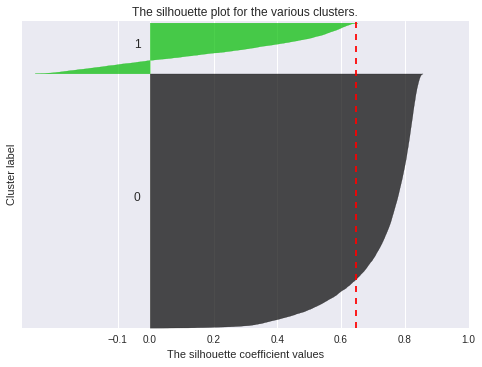

# Table of Contents
  * [Introduction](#introduction)
  * [Parallel Kmeans Algorithms](#parallel-kmeans-algorithms)
      * [OpenMP, MPI and hybrid MPI-OpenMP parallelization](#openmp-mpi-and-hybrid-mpi-openmp-parallelization)
      * [Advanced Feature: CUDA](#advanced-feature-cuda)
  * [Applications](#applications)
      * [Forest Cover Type Classification](#forest-cover-type-classification)
      * [Advanced Feature: Detecting Abnormal Climate Events](#advanced-feature-detecting-abnormal-climate-events)
  * [Discussion](#discussion)
  * [Computational Platforms and Software Libraries](#computational-platforms-and-software-libraries)
  * [References](#references)
  
---  
# Introduction
K-means clustering is a simple and scalable clustering method, which partitions observations into k clusters in an objective manner. It has very broad applications, such as image segmentation, retail product classification (Kusrini, 2015), environmental problems like greenhouse gas emissions (Kijewska and Bluszcz, 2015). K-means clustering could be used in combination with other advanced methodologies. For example, it was used with support vector machine (SVM) to perform automatic text classification (Perrone and Connell, 2000). It could also be used as a preprocessing method, such as initialization in a hidden Markov model (HMM) (Hu and Zanibbi, 2011). Its extensive applications and its simple computational complexity make k-means clustering one of the popular methods today.

Finding the minimum of a k-means cost function is a NP-hard problem when the dimension d>1 and the number of clusters k>1. Scientists came up with several heuristic methods to find the local minimum, but the process is still computationally-intensive, especially for large datasets with high dimensional features. Therefore, we want to implement a parallel version of a k-means heuristic method on a cluster of machines, to significantly speed up the algorithm, without sacrificing its accuracy. 

A typical approach for k-mean clustering is Expectation–Maximization (E–M). E-step assigns points to the nearest cluster center, while M-step sets the cluster centers to the mean. Below is an animation demonstating the Kmean algorithm, based on a wonderful [K-means visualization made by Naftali Harris ](https://www.naftaliharris.com/blog/visualizing-k-means-clustering/).

---
# Parallel Kmeans Algorithms

## OpenMP, MPI and hybrid MPI-OpenMP parallelization

### OpenMP

With OpenMP parallelization, only E-step can be directly parallelized. If M-step is directly parallelized with OpenMP pragmas, different data points might be added to one cluster at the same time, leading to Write-After-Write (WAW) harzard. Although it is possible to make drastic modifications to parallelize the M-step, it contradicts the basic idea of OpenMP that the serial code shoud be almost untouched. Therefore, we only focus on the E-step. 
[(View our OpenMP code)](Parallel_Algorithm/OpenMP/Kmean_omp.c)

Unsurprisingly, while the E-step scales well, the M-step even gets slower because of thread overheads. Although the M-step is not time-consuming in the serial case, it finally becomes the bottleneck when the number of cores gets large:

[(View the raw timing log)](Timing_Results/log/Blobs_OpenMP.log)

Because the compute node we are testing has only [32 CPUs](#computational-platforms-and-software-libraries), the performance gets lower with 64 threads due to the implicit context-switching and increased overheads. Same for the MPI and the hybrid tests below.

### MPI

With MPI, we can distribute data points to different processes using MPI_Bcast, and use MPI_Allreduce to exchange information whenever needed. Thus, both the E-step and the M-step can be parallelized. [(View our MPI code)](Parallel_Algorithm/MPI/Kmean_mpi.c)

This time, we get speed-up in both steps, so the overall scaling is better than OpenMP.

[(View the raw timing log)](Timing_Results/log/Blobs_MPI.log)

### Hybrid MPI-OpenMP

We simply add OpenMP pragmas to the MPI code, to get the hybrid version. This time we have many combinations of OpenMP threads and MPI processes to test. In general, we find that the speed-up depends on the product of the number of OpenMP threads (n_omp hereinafter) and the number of MPI processes (N_MPI hereinafter):

[(View the raw timing log)](Timing_Results/log/Blobs_hybrid.log)

Interestingly, for N_MPI*n_omp=32, we have tested 4 cases (N_MPI,n_omp) = (32,1), (16,2), (8,4) or (4,8), and all of them have almost the same speed. 
[(see the exact time use in the last cell)](https://github.com/JiaweiZhuang/CS205_final_project/blob/master/Timing_Results/plot_timing.ipynb)

### Improvements over Previous Works

Our main reference for the OpenMP&MPI Kmean algorithm is Bisgin 2008, along with their [public code](http://www.ece.northwestern.edu/~wkliao/Kmeans/index.html). We have made a couple of improvements over their original algorithm:
* Their algorithm always use the first N_cluster data points as the initial cluster center, which can be inefficient and might not find the global minimum. This is understandable because generating random indices in C is not straightforward. To facilitate random initialization and to make a fair comparison with Python's sklearn.cluster.KMeans, we build a seamless interface between C and Python using the [NetCDF library](#the-netcdf4-library-for-data-io). Random initial centers are generated by Python and written into file. Then, both the Python and the C versions use the same starting points from that file. This ensures the same amount of computation for both Python and C, along with the parallel C version at different number of cores. By using the same initial condition, we have confirmed that our serial C version has essential the same speed as Python's sklearn.cluster.KMeans, and all our parallel versions show significant speed up.
* In the OpenMP version, they use "atomic" operations in the M-step to avoid data-racing. However, in our test, atomic operation significantly slows down the M-step, which more than compensates the speed-up of E-step. To cope with this issue, we refactor the M-step to move it out of the OpenMP parallel region, making the overall scalability much better.
* In MPI the version, their orginal code is unnecessarily redundant. By making use of MPI_IN_PLACE, we avoid duplicating variables for MPI function calls such as MPI_Allreduce. We also use MPI_Scatterv, which is a more flexible version of MPI_Scatter, to allow different CPUs to hold different numbers of data points. This allows us to use any number of CPUs for any number of data points.
* We also implemented an option to use correlation as the measure of "distance". It improves the clustering results in the [SSW study](#advanced-feature-detecting-abnormal-climate-events) later in this page. 

## Advanced Feature: CUDA

Given the massive potential of parallelism on GPU, we implemented a parallel version of k-means algorithm using Nvidia CUDA library. In our implementation, we parallelize the E-step by distributing the computations of the nearest distance over blocks on "device". Also, 
we use reduction to help check the convergence of clustering (see the "reduce" function). For M-step, we decide not to parallelize (parallelize means using reduction in this case), because by including the time for data to tranfer between device and host, which is a huge burden, the parallel version has no outstanding advantages over the serial version of M-step. Similar to the OpenMP version, our focus is also on the E-step. [(View our CUDA code)](Parallel_Algorithm/Cuda/kmeans_cdf.cu)

Generally, we see that the timing and scaling is quite promising when the number of threads per block is less than 32, which is also the wrap size. The "other" portion is no doubt the data tranfer between device and host, and it's even a more severe bottleneck than the serial M-step. By the way, we can definitely improve this by using better I/O hardware, i.e. using SSD instead of EBS volume for the ec2 instance, and optimizing memory access, e.g. using shared memory as possible and coalesce memory operations. Also, note that compared to OpenMP/MPI version, the time of E-step using CUDA is sinigicantly shorter. 

The weird bump up as the number of threads goes up to 64 is because we run out of shared memory, but we're not sure why it affects the M-step so much. 

For optimization, currently we've used parallel reduction to speedup the checking of convergence, and matrix transpose to improve memory access locality as the number of points is significantely larger than the number of features. We haven't tried deploying this version on multiple GPU, because the documentation is rare online and a single Tesla K80 GPU already has enough capacity (4992 cores, 26 SMs, 2048 threads per SM) to parallelize our computation.

---
# Applications
## Forest Cover Type Classification
In this section, we utilize k-means to perform forest covertype classification with cartographic variables only. Our dataset is obtained from the UCI KDD archive, and was original derived from US Forest Service (USFS) Region 2 Resource Information System data and US Geological Survey (USGS) data. The study area is in Roosevelt National Forest of northern Colorado, which is a forest region with the minimum human disturbance and therefore mostly goes through natural process.

It is a fairly large dataset that contains 581012 observations and 54 features including numerical and categorical features. The attributes include elevation, slope, horizontal distance to hydrology, vertical distance to hydrology, and etc. This dataset is already labeled with 1-7 which represents 7 different forest cover types: Spruce/Fir, Lodgepole Pine, Ponderosa Pine, Cottonwood/Willow, Aspen, Douglas-fir, and Krummholz. Our goal is to implement a k-means based classification method, and to show that besides basic clustering problems, k-means has a broad usage in various data science problems. 

Our first step is to normalize the feature values since some of them are in single digits whereas some are in thousands. Then we split the whole dataset into a training set and a testing set with the ratio 7:3. Since the dataset is quite unbalanced, our stragegy is to randomly pick the desired percentage of entries out of each category, and then join them to a final sampling dataset. We always use this method each time we need a dataset split in this problem.

We then split the training set into a sub-training set and a validation set with the ratio 8:2. The testing set we obtained above would be untouched until the final test. Our selection process of the best K is as follows:
1. cluster the sub-training set using k-means with a given K.
2. pick the 7 purest clusters corresponding to the 7 labels respectively to be the standard clusters. 
Compute the 7 cluster centers for use.
3. For each data point in the validation set, assign this point to the cluster with the closest cluster center.
4. Calculate the average classification accuracy of the validation set.

We choose K from 7 to 30, repeat the above steps and find that 23 is the best cluster number. Finally we perform k-means on the whole training set to get the 7 centers and test on the testing set. The final classification accuracy is around 30%.

The classification accuracy is not very high, so we would like to take a further look at the dataset. It is hard to directly visualize the dataset due to its high feature dimension, so we apply PCA to perform dimension reduction first and then plot the scatter graph based on the first two principle components. We choose 10 percent out of the testing samples, and color code the points using the true labels(the first graph) and the predicted labels(the second graph). Now we could see that, the original data points are acutally mixed on the 2D projection. Our k-means algorithm actually does a good clustering job since the lumps are seperated well in color. Therefore, for this problem, more complicated algorithms such as artifical neural network would do a better job (Dean, 1999) with classification accuracy at around 70%. But our result is already much better than the randomly classification which only holds an accuracy at around 14%.

## Advanced Feature: Detecting Abnormal Climate Events
In this section, we will explore the application of k-means clustering technique on identifying abnormal climate events. Abnormal climate events are usually identified if a highly simplified index exceeds an arbitrary threshold. For example, El Nino events are identified if the Nino 3.4 index exceeds the threshold of 0.5&deg;C. This simple criteria works in some cases, however, there are two caveats associated with this methodology. First, the highly simplified index may not well capture all the main dynamic aspects. Second, setting an arbitrary threshold makes it a subjective way of identifying abnormal events.  

K-means clustering serves as a powerful technique in dealing with those caveats. First, instead of using a highly simplified index, a high dimensional feature vector characterizing the event from multiple dynamical aspects can be utilized. In addition, k-means clustering is highly scalable to cluster large datasets, such as those from simulations. Second, k-means clustering is able to identify different states in a completely objective manner with no preconceived notion of the groups and no preselection on the basis of known influencing factors (Coughlin and Gray, 2009). Third, k-means clustering technique is especially useful for detecting abnormal events, because k-means clustering easily allows for unevenly distributed clusters, whereas some other techniques, such as hierachical clustering, tend to determine clusters of similar sizes.

The abnormal climate events we would like to explore is called sudden stratospheric warming (SSW), which happens sometime in the stratosphere near the North pole during winters. It is important to understand them because they usually proceed extreme weathers in the troposphere by about a month, and thus have the potential to serve as a forecasting tool. 

---
> ### What is Sudden Stratospheric Warming (SSW)?
> During Northern hemisphere winter, because of the very cold temperature at the pole, the climatological zonal winds in the stratosphere are generally westerly and their strength increases with height. These winds can form very persistent "polar night jet” vortex, as shown in Fig(a). However, at times this zonal-mean configuration can be dramatically disturbed, as shown in Fig(b) and Fig(c), with the vortex being displaced or split. At the same time, the stratosphere near the pole experiences sudden warming, with latitudinal temperature gradient and zonal-mean winds at the pole being reversed.

---

### Data and Measure of Distance
Our analysis is based on the daily output from a 49-year all-winter simulation, which gives us more than 17,000 samples. Daily data is pre-processed to get averaged temperatures at three latitudes, and their tendencies over time, latitudinal temperature gradient, and its tendency, averaged zonal winds at two latitudes, and their tendencies, and wave-number one and two components of geo-potential height. Temperatures are averaged over 60&deg;N to 70&deg;N, 70&deg;N to 80&deg;N, and 80&deg;N to 90&deg;N, while zonal winds are averaged over 60&deg;N to 70&deg;N and 70&deg;N to 80&deg;N. Tendencies are calculated as the differences between its current value and its value 7 days before. Altogether, there are 252 features for a sample, including 14 features each vertical level, and 18 levels in total across the stratosphere. 

Because a sample includes different types of features, such as temperature, velocity and length scale, we need to carefully choose the measure of distance.  Here, we choose 1-corr(x1,x2) as the measure of distance, because we consider two patterns to be close to each other if they are highly correlated. 

### Results
We have tested the number of clusters from 2 to 4, and use Silhouette score to evaluate the result of clustering. Two clusters give the highest averaged score of 0.65, as shown in Fig 1, while the averaged score for three clusters is 0.47, and for four clusters is 0.42. Therefore, we think two clusters are separated well by k-means clustering. 

Figure 1: Silhouette score

Fig 2 shows the temperature anomaly over the stratosphere for both clusters. The second cluster shows a substantial warming (more than 10K) compared to the first cluster. 

Figure 2: Averaged temperature anomaly for each cluster

The vortex structure shown in Fig. 3 is consistent with the temperature anomaly. For normal events, the polar vortex centers at the pole, while the vortex is displaced during abnormal warming period. These results are consistent with the findings from Coughlin and Gray, 2009, in which the analysis is based on observational data. 

Figure 3: Averaged potential vorticity for each cluster

Furthermore, we are also interested in different types of abnormal events, because they may be caused by different mechanisms, and may have different effects on future weather patterns. Therefore, we further cluster the abnormal events based on the amplitude and phase angle of the wave-number one and two geo-potential height. We find that the vortex can be displaced toward different longitude, or even be split into two vortices.

Figure 4: Averaged potential vorticity for each sub-cluster

---
# Discussion

Although the algorithm of k-means clustering is fast and simple, it has its own limitations compared to other more complicated algorithms. First of all, the clustering procedure and the final clusters highly depend on the number of clusters *k*, and extra effort needs to be made to find an optimal *k*. Hierarchical clustering could easily overcome this obstacle. Its computation is independent of the number of clusters *k*, and its hierarchical structure can provide more insight to determine the number of clusters *k*. Secondly, k-means clustering assumes spherically distributed clusters and equal probabilities for each clusters. To overcome these caveats, Gaussian mixture models include a covariance matrix and weights in its optimization. In addition, k-means clustering works poorly on non-convex clusters, while spectral clustering does a better job in this situation. 

Admittedly, there are more complicated algorithms that work better than k-means clustering in some cases, k-means clustering is still a powerful algorithm dealing with large datasets with high dimensional features. For a simple clustering algorithm, like k-means to have a better performance, more effort needs to be made to pre-process data and to map them onto a space where they are more spherically distributed. There is no the best algorithm, but the most suitable situation to apply an algorithm.

---
# Computational Platforms and Software Libraries

## Amazon EC2 cloud computing environment (OpenMP & MPI)

Although MPI programs typically run on local HPC facilities like Harvard's Odyssey, we found that MPI jobs at small-to-medium-scales (e.g. < 64 cores) can also run very efficiently on cloud platforms like Amazon EC2. This gives us great flexibility in requesting computational resources, so that we can finish simulations very quickly without worrying about job pending on Odyssey.

The instance we use for the timing tests is cc2.8xlarge [(see detailed cpuinfo)](Timing_Results/info/cpu). In the Amazon console, it is said to have 64 "virtual" CPUs. However, it actually only contains 32 physical CPUs as shown by the "lscpu" command.

We have installed various software libraries to facilitate our K-mean application. An EC2 AMI is made public the so that others can also run our codes directly without installing those libraries on their own. Search for "ami-3f79ef29" or  "GCC_NetCDF_MPI_Conda_04162017" in the N. Virginia region.

## Amazon EC2 cloud computing environment (CUDA)

The instance we use for timing tests is p2.xlarge, with 1 Tesla K80 GPU, 4 "virtual" CPUs. For the K80 GPU, it has 4992 CUDA cores, 26 SMs, and 2048 threads per SM. 

## The OpenMPI library

We built OpenMPI 2.1.0 upon the gcc4.8.3 compiler, to get the wrapped "mpicc" compiler. The script for building this library is available [here](Build_Library/openmpi_build/install_openmpi.sh).

## The Cuda library

We use the CUDA 7.5 and the nvcc compiler included in the toolkit. For convenience, there is a pre-built AMI: search "ami-52f7b345" in the N. Virginia region.

## The NetCDF4 library for data I/O

While high-level languages like Python and Matlab can read and write data in any formats very conveniently, data I/O in low-level languages such as C and Fortran can be a pain. Therefore, we make use of the [NetCDF4 library](https://www.unidata.ucar.edu/software/netcdf/) to facilitate data I/O. It can be viewed as a structured combination of numerical (like binary) and text (like ASCII) data. The numerical part makes it suited for storing large data arrays in our application, and the text description part makes it self-descriptive, which is a significant advantage over plain binary files. All commonly used languages have NetCDF4 APIs and are able to operate on this data format.

In Python, the [xarray package](http://xarray.pydata.org/en/stable/) is a good way to handle NetCDF data. It is a higher-dimension extension of the well-known Pandas package. While Pandas is great for data science, xarray also suits various physical sciences.

In C, we've provided a [script](Build_Library/netCDF_build/install_netCDF.sh) to install that library. A single build can work for various compilers including the basic gcc compiler, the pgcc compiler for OpenACC, and the nvcc compiler for CUDA. With the NetCDF-C library, we can read all the data we need and dynamically allocate memories for them in a single function [readX()](Parallel_Algorithm/shared/ncdf_util.c)

It is also worth mentioning that, NetCDF is the standard data format used for the Intergovernmental Panel on Climate Change (IPCC) report :)

# References
Bisgin H, Dalfes H N. Parallel clustering algorithms with application to climatology[C] *Geophysical Research Abstracts* 2008, 10.

Blackard, J.A., Dean, D.J., 1999. Comparative accuracies of artificial neural networks and discriminant analysis in predicting forest cover types from cartographic variables. *Computers and Electronics in Agriculture* 24 (1999): 131–151.

Coughlin, K., and Lesley Janet Gray. "A continuum of sudden stratospheric warmings." *Journal of the Atmospheric Sciences* 66.2 (2009): 531-540.

Li, M., Cheng, Y., Zhao, H., 2004. Unlabeled Data Classification via Support Vector Machines and k-means Clustering.* Proceedings of the International Conference on Computer Graphics*, Imaging and Visualization (CGIV’04).

Kijewska, A., Bluszcz, A., 2015. Research of varying levels of greenhouse gas emissions in European countries using the k-means method. *Atmospheric Pollution Research* 7 (2016):935-944

Kusrini, K. 2015. Grouping of Retail Items by Using K-Means Clustering.  Procedia Computer Science 72 ( 2015 ): 495–502.
Perrone, M.P., Connell, S.D., 2000. K-Means Clustering for Hidden Markov Models. *Proceedings of the Seventh International Workshop on Frontiers in Handwriting Recognition*. 

