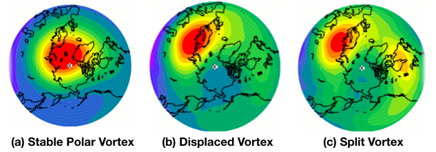

# Table of Contents
  * [Introduction](#introduction)
  * [Parallel Kmeans Algorithms](#parallel-kmeans-algorithms)
      * [OpenMP, MPI and hybrid MPI-OpenMP parallelization](#openmp-mpi-and-hybrid-mpi-openmp-parallelization)
      * [Advanced Feature: Cuda](#advanced-features-cuda)
  * [Applications](#applications)
      * [Forest Cover Type Classification](#forest-cover-type-classification)
      * [Advanced Feature: Detecting abnormal meteorology events](#advanced-feature-detecting-abnormal-meteorology-events)
  * [Computational Platforms and Software Libraries](#computational-platforms-and-software-libraries)
  * [References](#references)
  
---  
# Introduction
Many huge data sets are now publicly available. There are several ways to turn those large amounts of data into useful knowledge. 
Here we focus on exploratory data analysis, or unsupervised machine learning, which means finding structural information without prior knowledge.

Among all the unsupervised learning methods, k-means is a commonly used algorithm, which partitions observations into k clusters in which each 
observation belongs to the cluster with the nearest mean. Finding the minimum of a k-means cost function is a NP-hard problem when the dimension 
d>1 and the number of clusters k>1. Scientists came up with several heuristic methods to find the local minimum, but the process is still highly 
computationally-intensive, especially with huge data sets. We want to implement a parallel version of a k-means heuristic method on a cluster of machines, 
to significantly speed up the computing time of the clustering process, without any reduction on the accuracy rate of the clustering model.

A typical approach for k-mean clustering is Expectation–Maximization (E–M). E-step assigns points to the nearest cluster center, while M-step sets the cluster centers to the mean. 

Below is an animation demonstating the Kmean algorithm, based on a wonderful [K-means visualization made by Naftali Harris ](https://www.naftaliharris.com/blog/visualizing-k-means-clustering/).

---
# Parallel Kmeans Algorithms

## OpenMP, MPI and hybrid MPI-OpenMP parallelization

### OpenMP

With OpenMP parallelization, only E-step can be directly parallelized. If M-step is directly parallelized with OpenMP pragmas, different data points might be added to one cluster at the same time, leading to Write-After-Write (WAW) harzard. Although it is possible to make drastic modifications to parallelize the M-step, it contradicts the basic idea of OpenMP that the serial code shoud be almost untouched. Therefore, we only focus on the E-step. 
[(View our OpenMP code)](Parallel_Algorithm/OpenMP/Kmean_omp.c)

Unsurprisingly, while the E-step scales well, the M-step even gets slower because of thread overheads. Although the M-step is not time-consuming in the serial case, it finally becomes the bottleneck when the number of cores gets large:

[(View the raw timing log)](Timing_Results/log/Blobs_OpenMP.log)

Because the compute node we are testing has only [32 CPUs](#computational-platforms-and-software-libraries), the performance gets lower with 64 threads due to the implicit context-switching and increased overheads. Same for the MPI and the hybrid tests below.

### MPI

With MPI, we can distribute data points to different processes using MPI_Bcast, and use MPI_Allreduce to exchange information whenever needed. Thus, both the E-step and the M-step can be parallelized. [(View our MPI code)](Parallel_Algorithm/MPI/Kmean_mpi.c)

This time, we get speed-up in both steps, so the overall scaling is better than OpenMP.

[(View the raw timing log)](Timing_Results/log/Blobs_MPI.log)

### Hybrid MPI-OpenMP

We simply add OpenMP pragmas to the MPI code, to get the hybrid version. This time we have many combinations of OpenMP threads and MPI processes to test. In general, we find that the speed-up depends on the product of the number of OpenMP threads (n_omp hereinafter) and the number of MPI processes (N_MPI hereinafter):

[(View the raw timing log)](Timing_Results/log/Blobs_hybrid.log)

Interestingly, for N_MPI*n_omp=32, we have tested 4 cases (N_MPI,n_omp) = (32,1), (16,2), (8,4) or (4,8), and all of them have almost the same speed. 
[(see the exact time use in the last cell)](https://github.com/JiaweiZhuang/CS205_final_project/blob/master/Timing_Results/plot_timing.ipynb)

## Advanced Feature: CUDA

---
# Applications
## Forest Cover Type Classification
In this section, we utilize k-means to perform forest covertype classification with cartographic variables only. Our dataset is obtained from the UCI KDD archive, and was original derived from US Forest Service (USFS) Region 2 Resource Information System data and US Geological Survey (USGS) and USFS data. The study area is in Roosevelt National Forest of northern Colorado, which is a forest region with the minimum human disturbance and therefore mostly goes through natural process.

It is a fairly large dataset that contains 581012 observations and 54 features including numerical and categorical features. The attributes include elevation, slope, horizontal distance to hydrology, vertical distance to hydrology, and etc. This dataset is already labeled with 1-7 which represents 7 different forest cover types: Spruce/Fir, Lodgepole Pine, Ponderosa Pine, Cottonwood/Willow, Aspen, Douglas-fir, and Krummholz. Our goal is to implement a k-means based classification method, and to show that besides basic clustering problems, k-means has a broad usage in various data science problems. 

Our first step is to normalize the feature values since some of them are in single digits whereas some are in thousands. Then we split the whole dataset into a training set and a testing set with the ratio 7:3. Since the dataset is quite unbalanced, our stragegy is to randomly pick the desired percentage of entries out of each category, and then join them to a final sampling dataset. We always use this method each time we need a dataset split in this problem.

We then split the training set into a sub-training set and a validation set with the ratio 8:2. The testing set we obtained above would be untouched until the final test. Our selection process of the best K is as follows:
1. cluster the sub-training set using k-means with a given K.
2. pick the 7 purest cluster corresponding to each label to be the 7 standard clusters. 
Compute the 7 cluster centers for use.
3. For each data point in the validation set, assign this point to the cluster with the closest cluster center.
4. Calculate the average classification accuracy of the validation set.

We choose K from 7 to 30, repeat the above steps and find that 23 is the best cluster number. Finally we perform k-means on the whole training set to get the 7 centers and test on the testing set. The finally classification accuracy is 28.9%.

## Advanced Feature: Detecting abnormal meteorology events
In this section, we will explore the application of k-means clustering technique on identifying abnormal climate events. Abnormal climate events are usually identified if a highly simplified index exceeds an arbitrary threshold. For example, El Nino events are identified if the Nino 3.4 index exceeds the threshold of 0.5&deg;C. This simple criteria works in some cases, however, there are two caveats associated with this methodology. First, the highly simplified index may not well capture all the main dynamic aspects. Second, setting an arbitrary threshold makes it a subjective way of identifying abnormal events.  

K-means clustering serves as a powerful technique in dealing with those caveats. First, instead of using a highly simplified index, a high dimension feature vector characterizing the event from multiple dynamical aspects can be utilized. In addition, k-means clustering is highly scalable to cluster huge datasets, such as those from simulations. Second, k-means clustering is able to identify different states in a completely objective manner with no preconceived notion of the groups and no preselection on the basis of known influencing factors (Coughlin and Gray, 2009). Third, k-means clustering technique is especially useful for detecting abnormal events, because k-means clustering easily allows for uneven groups, whereas some other techniques, such as hierachical clustering, tend to determine groups of similar sizes.

The abnormal climate events we would like to explore is called sudden stratospheric warming (SSW), which happens sometime in the stratosphere near the North pole during winters. It is important to understand them because they usually lead extreme weathers in the troposphere by about a month, and thus have the potential to serve as a forecasting tool. 

---
> ### What is Sudden Stratospheric Warming (SSW)?
> During Northern hemisphere winter, because of the very cold temperature at the pole, the climatological zonal winds in the stratosphere are generally westerly and their strength increases with height. These winds can form very persistent "polar night jet” vortex, as shown in Fig(a). However, at times this zonal-mean configuration can be dramatically disturbed, as shown in Fig(b) and Fig(c), with the vortex being displaced or split. At the same time, the stratosphere near the pole experiences sudden warming, with latitudinal temperature gradient and zonal-mean winds at the pole being reversed.

---

---
# Computational Platforms and Software Libraries

## Amazon EC2 cloud computing environment

Although MPI programs typically run on local HPC facilities like Harvard's Odyssey, we found that MPI jobs at small-to-medium-scales (e.g. < 64 cores) can also run very efficiently on cloud platforms like Amazon EC2. This gives us great flexibility in requesting computational resources, so that we can finish simulations very quickly without worrying about job pending on Odyssey.

The instance we use for the timing tests is cc2.8xlarge [(see detailed cpuinfo)](Timing_Results/info/cpu). In the Amazon console, it is said to have 64 "virtual" CPUs. However, it actually only contains 32 physical CPUs as shown by the "lscpu" command.

We have installed various software libraries to facilitate our K-mean application. An EC2 AMI is made public the so that others can also run our codes directly without installing those libraries on their own. Search for "ami-3f79ef29" or  "GCC_NetCDF_MPI_Conda_04162017" in the N. Virginia region.

## The OpenMPI library

We built OpenMPI 2.1.0 upon the gcc4.8.3 compiler, to get the wrapped "mpicc" compiler. The script for building this library is available [here](Build_Library/openmpi_build/install_openmpi.sh).

## The NetCDF4 library for data I/O

While high-level languages like Python and Matlab can read and write data in any formats very conveniently, data I/O in low-level languages such as C and Fortran can be a pain. Therefore, we make use of the [NetCDF4 library](https://www.unidata.ucar.edu/software/netcdf/) to facilitate data I/O. It can be viewed as a structured combination of numerical (like binary) and text (like ASCII) data. The numerical part makes it suited for storing large data arrays in our application, and the text description part makes it self-descriptive, which is a significant advantage over plain binary files. All commonly used languages have NetCDF4 APIs and are able to operate on this data format.

In Python, the [xarray package](http://xarray.pydata.org/en/stable/) is a good way to handle NetCDF data. It is a higher-dimension extension of the well-known Pandas package. While Pandas is great for data science, xarray also suits various physical sciences.

In C, we've provided a [script](Build_Library/netCDF_build/install_netCDF.sh) to install that library. A single build can work for various compilers including the basic gcc compiler, the pgcc compiler for OpenACC, and the nvcc compiler for CUDA. With the NetCDF-C library, we can read all the data we need and dynamically allocate memories for them in a single function [readX()](Parallel_Algorithm/shared/ncdf_util.c)

It is also worth mentioning that, NetCDF is the standard data format used for the Intergovernmental Panel on Climate Change (IPCC) report :)

# References
Coughlin, K., and Lesley Janet Gray. "A continuum of sudden stratospheric warmings." *Journal of the Atmospheric Sciences* 66.2 (2009): 531-540.
